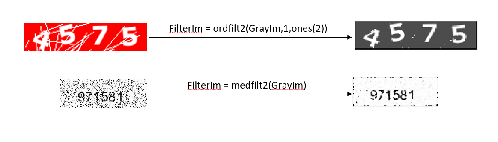
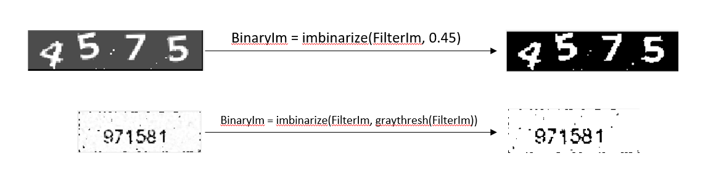
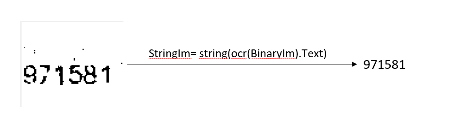
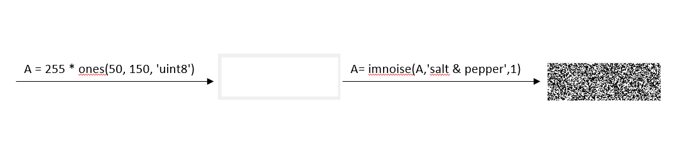
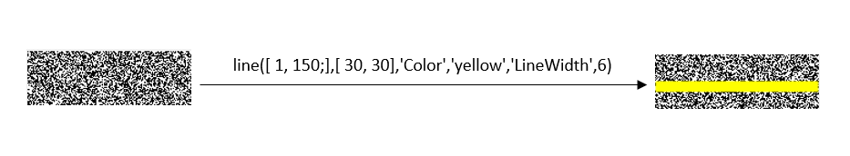
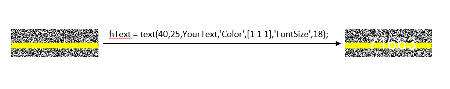
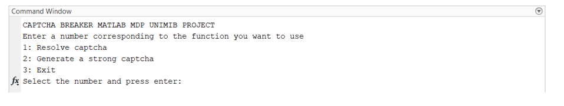

# Captchabreaker Matlab script
Matlab script to resolve captcha images.

## Introduction
A captcha test is designed to determine if an online user is really a human, or if it is a bot. Captcha stands for "Completely Automated Public Turing Test To Tell Computers and Humans Apart". Users often come across captcha tests on the web.
This script wants to modify captcha in ordere to make it more computer readeble through Matlab language.

## Description
This project has two main goals: 
1. Solve the captcha and get the string;  
2. Generate a new strong captcha.   

### Solve the captcha and get the string
It was necessary to use filter commands to remove the noise. The filters used were the median filter, for images with a lot of noise, and the order filter, for images with less noise.  

After removing the noise from the captcha, it has been applied the binarization to obtain an image composed by only two colors (black and white). The binarization works with two different thresholds according to the image: all the pixels less than the threshold will be set to black; all the other pixels will be set to white. 

Finally, the binarized image was converted in RGB image. Then it was processed through the OCR (Optical character recognition) function provided by computer vision toolbox. The output was properly filtered to obtain the correct integer result.  

 
<h3>Generate strong captcha</h3>
The second goal of this project is to generate a strong captcha. The first step was to generate a white image and introduce the “salt and pepper“ noise into it.
 

A yellow rectangle has been added in order to make the captcha more human readable, it will work as a partial background to the captcha code.
 

Random white text has been introduced in the image. White text has low level of contrast on yellow background, for this reason the algorithm cannot resolve this captcha easily. Eventually the image will be saved in the project folder.
 

 

## Result

